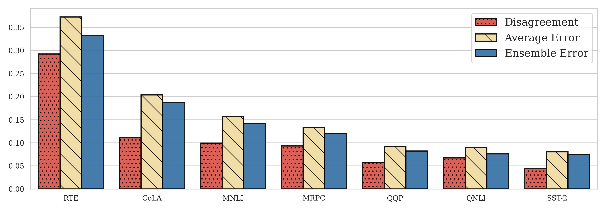
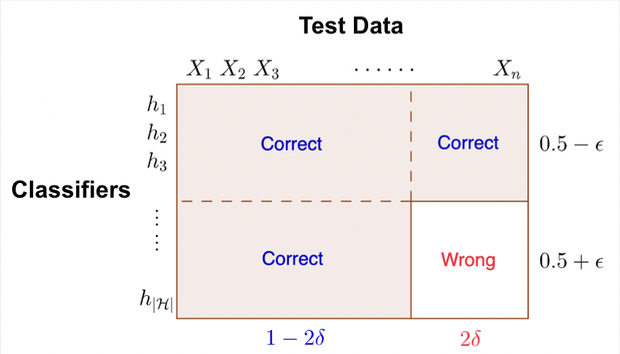
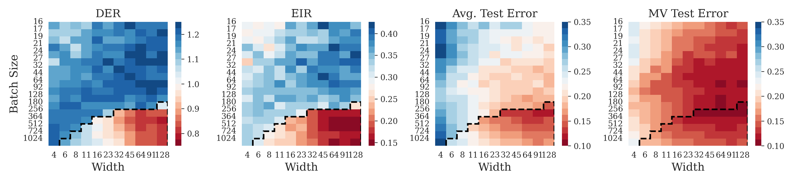

# When is one classifier enough? ICML 2023 submission

## Competence plots

Below we show what we call "competence plots" for a variety of experimental settings, verifying that Assumption 1 is satisfied. To do this, we estimate both $P(W_\rho \in [t,1/2))$ and $P(W_\rho \in [1/2, 1-t])$ on test data. To do this, given a test set of examples $(x_1,y_1),\dots,(x_m,y_m)$ and classifiers $h_1,\dots,h_N$ drawn from $\rho$, we construct the estimator

$$
\widehat{W}_\rho^{(j)} = \frac{1}{N}\sum_{n=1}^N \mathbb{1}(h_n(x_j)\neq y_j)
$$

and calculate $P(W_\rho \in [t,1/2))$ and $P(W_\rho \in [1/2, 1-t])$ from the empirical CDF of 

$$
\widehat{W}_\rho^{(1)},\dots,\widehat{W}_\rho^{(m)}.
$$

We observe that the red curves lie above the blue curves for each setting, showing that $P(W_\rho \in [t,1/2)) \geq P(W_\rho \in [1/2, 1-t])$ for all $t\in (0,1/2)$, as required by competence.

## Bayesian versus deep ensembles

Below, we compare the behavior of deep ensembles to Bayesian ensembles on two tasks:

- ResNet20 architectures on the CIFAR-10 task
- A CNN-LSTM architecture on the IMDB task

For the Bayesian ensembles, we use samples provided openly with the paper [Izmailov, 2021], and train deep ensembles (20 models trained from independent initialization) on the same architectures and datasets.

We remark that the ResNet20 models used here are actually significantly smaller than the larger ResNet18 models used in other experiments in the paper (e.g. Figure 3); the ResNet20 model uses a width factor of 16.

We make a few interesting observations regarding these results.

- The Bayesian ensembles offer higher ensemble improvement across both tasks, as measured by the EIR, than the deep ensembles -- by a significant margin the case of the IMDB task. 
- This is well-captured by the DER, which we find is above the threshold of 1 for the ResNet20 using both ensembling methods and the CNN-LSTM Bayesian ensemble, and significantly below the threshold of 1 for the CNN-LSTM deep ensemble.
- The average error rate of the Bayesian models is very bad; it's clear that ensembling is necessary when generating individual models in this way (though this is not surprising). 
- It is not definitive whether Bayesian ensembling is beneficial in general. For the CNN-LSTM/IMDB task, the Bayesian ensemble performs better than any one model on average, and better than the deep ensemble. For the ResNet20/CIFAR-10 task, the Bayesian ensemble performs only slightly better than a single model SGD-trained model on average, and significantly worse than a deep ensemble.  

## Fine-tuned BERT models on GLUE tasks

Here, we try a different type of deep ensembling. We use 20 pre-trained BERT models included with the paper [Sellam, 2022], each trained from an independent intialization, and then fine-tuned on the GLUE tasks. Each of the fine-tuned models are used to form an ensemble.

In the above plot, we show the disagreement, average error rate, and majority-vote error rates for these ensembles across the 7 GLUE classification tasks. These experiments highlight an important point regarding the disagreement as a metric characterizing ensemble improvement: the disagreement can be nominally very high (e.g. the RTE task, in which it is almost 30%), but see very low improvement from ensembling. However, the DER captures this much better: the disagreement is nominally high, but _small relative to the average error rate_. Indeed, the DER is small ($<1$) for all of these tasks, as is the improvement from ensembling.

## First-order bound $L(h_{mv}) \leq 2E[L(h)]$ is tight even when $E[M_\rho(X,Y)] > 0$

Here we provide an example of when the naive bound $L(h_{mv}) \leq 2E[L(h)]$ is tight _even when_ the assumption $E[M_\rho(X,Y)] > 0$ (required by the C-bound of [Laviolette, 2017] and [Breiman, 2001]) is met. This is in contrast to the competence assumption, which, as we show, guarantees $L(h_{mv}) \leq E[L(h)]$.

Consider a classification problem with two classes. We describe an ensemble which has positive expected margin, but satisfies $L(h_{mv}) = 2E[L(h)]$. For given $\epsilon > 0$, slightly less than half, $0.5-\epsilon$, fraction of classifiers are the perfect classifier. All of the other $0.5+\epsilon$ fraction of classifiers, on the contrary, now correctly predicts on the same $1-2\delta$ fraction of the test data and incorrectly predicts on the other $2\delta$ fraction of the test data. With this composition of classifiers, the majority-vote error rate is $2\delta$ even when the average error rate is $\delta(1+2\epsilon)$. The margin of the new composition of classifiers is $1-2\delta(1+2\epsilon)$, which can be any value smaller than $1$. Taking $\epsilon \to 0$ concludes that the first-order upper bound is tight when the margin is arbitrarily high. Hence the condition $E[M_\rho(X,Y)] > 0$ (used by [Laviolette, 2017] and [Breiman, 2001]) is, unlike the competence assumption, insufficient to guarantee ensembling cannot hurt performance.

## Additional ResNet18/CIFAR-10 results

Here we include two additional plots for the large-scale ResNet18/CIFAR-10 experiments which we think offer added insight. 

In particular, here we also show the average error rate and the majority-vote error rates in batch size/width space. We observe that we can often achieve similar error rates to a single larger model with an ensemble of smaller, non-interpolating models. This is in line with conclusions found in [Abe, 2022].

## References

[Izmailov, 2021] Pavel Izmailov, Sharad Vikram, Matthew D Hoffman, and Andrew Gordon Gordon Wilson.
What are bayesian neural network posteriors really like? In Marina Meila and Tong Zhang,
editors, Proceedings of the 38th International Conference on Machine Learning, volume 139 of
Proceedings of Machine Learning Research, pages 4629–4640. PMLR, 18–24 Jul 2021.

[Sellam, 2022] Thibault Sellam, Steve Yadlowsky, Ian Tenney, Jason Wei, Naomi Saphra, Alexander D’Amour,
Tal Linzen, Jasmijn Bastings, Iulia Raluca Turc, Jacob Eisenstein, Dipanjan Das, and Ellie
Pavlick. The multiBERTs: BERT reproductions for robustness analysis. In International
Conference on Learning Representations, 2022.

[Breiman, 2001] Leo Breiman. Random forests. Machine learning, 45(1):5–32, 2001

[Laviolette, 2017] François Laviolette, Emilie Morvant, Liva Ralaivola, and Jean-Francis Roy. Risk upper bounds
for general ensemble methods with an application to multiclass classification. Neurocomputing,
219:15–25, 2017

[Abe, 2022] Taiga Abe, E. Kelly Buchanan, Geoff Pleiss, Richard Zemel, and John Patrick Cunningham.
Deep ensembles work, but are they necessary? In Alice H. Oh, Alekh Agarwal, Danielle
Belgrave, and Kyunghyun Cho, editors, Advances in Neural Information Processing Systems,
2022.