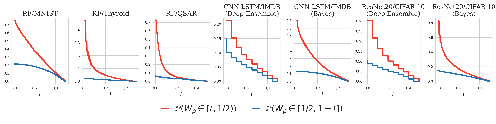
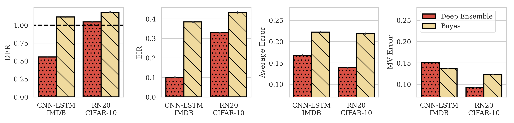

# When is one classifier enough? ICML 2023 submission

## Competence plots

Below we show what we call "competence plots" for a variety of experimental settings, verifying that Assumption 1 is satisfied. To do this, we estimate both $P(W_\rho \in [t,1/2))$ and $P(W_\rho \in [1/2, 1-t])$ on test data. To do this, given a test set of examples $(x_1,y_1),\dots,(x_m,y_m)$ and classifiers $h_1,\dots,h_N$ drawn from $\rho$, we construct the estimator

$$
\widehat{W}_\rho^{(j)} = \frac{1}{N}\sum_{n=1}^N \mathbb{1}(h_n(x_j)\neq y_j)
$$

and calculate $P(W_\rho \in [t,1/2))$ and $P(W_\rho \in [1/2, 1-t])$ from the empirical CDF of 

$$
\widehat{W}_\rho^{(1)},\dots,\widehat{W}_\rho^{(m)}.
$$

We observe that the red curves lie above the blue curves for each setting, showing that $P(W_\rho \in [t,1/2)) \geq P(W_\rho \in [1/2, 1-t])$ for all $t\in (0,1/2)$, as required by competence.

## Bayesian versus deep ensembles

Below, we compare the behavior of deep ensembles to Bayesian ensembles on two tasks:

- ResNet20 architectures on the CIFAR-10 task
- A CNN-LSTM architecture on the IMDB task

For the Bayesian ensembles, we use samples provided openly with the paper [Izmailov, 2021], and train deep ensembles (20 models trained from independent initialization) on the same architectures and datasets.

We make a few interesting observations regarding these results.

- The Bayesian ensembles offer higher ensemble improvement across both tasks, as measured by the EIR, than the deep ensembles -- by a significant margin the case of the IMDB task. 
- This is well-captured by the DER, which we find is above the threshold of 1 for the ResNet20 using both ensembling methods and the CNN-LSTM Bayesian ensemble, and significantly below the threshold of 1 for the CNN-LSTM deep ensemble.
- It i

## Fine-tuned BERT models on GLUE tasks

n

## References

[Izmailov, 2021] Pavel Izmailov, Sharad Vikram, Matthew D Hoffman, and Andrew Gordon Gordon Wilson.
What are bayesian neural network posteriors really like? In Marina Meila and Tong Zhang,
editors, Proceedings of the 38th International Conference on Machine Learning, volume 139 of
Proceedings of Machine Learning Research, pages 4629–4640. PMLR, 18–24 Jul 202